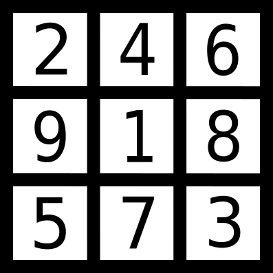

# Sudoku-solver-GUI-CNN [](https://www.python.org/)
> Solve a sudoku from its photo

## Sudoku solver
This program solves sudoku puzzles starting from a photo.\
Two different CNN (convolutional neural network) trained models can be used to recongize the digits, 
depending on whether the sudoku is unsolved or half-solved.\
A GUI (grapichal user interface) is provided.

## Table of contents
- [About the project](#about-the-project)
    - [CNN model](#cnn-model)
    - [Extrapolate a sudoku from an image](#extrapolate-a-sudoku-from-an-image)
    - [Solve a sudoku](#solve-a-sudoku)
    - [Project's GUI](#projects-GUI)
- [Getting started](#getting-started)
    - [Requirements](#requirements)
    - [Installation](#installation)
- [Usage](#usage)
    - [First page](#first-page)
    - [Second page](#second-page)
    - [Third page](#third-page)
- [Acknowledgements](#acknowledgements)

## About the project

The project is divided into different scripts that perform different functions:
the training of CNN models, the extrapolatation of sudoku from photos, the resolution of sudoku puzzles and the creation of a GUI.

### CNN model

The model is composed of various convolutional layers with different number of filters and kernel size. 
Other hidden layers are max pooling and flatten. The output is a dense layer. 
ReLU (Rectified Linear Unit) is used as the activation function for the hidden layers, while the output layer uses the softmax function. 
The Adam optimization algorithm and the categorical crossentropy loss function are used for the compilation.\
The model was trained on two different datasets. The first dataset is composed of the digits from 1 to 9 extracted from a sudoku magazine. 
This first dataset is contained in the file `sudoku_dataset.pkl` and is composed of 1310 28x28 images. 
The model was trained on this dataset with 15 epochs and an accuracy of 0.9990 has been obtained on the test set.\
The second dataset is a union of digits from the previous dataset and the MNIST handwritten digits dataset,
which combined reach a total of 71310 28x28 images. 
The model was trained on this dataset with 15 epochs and an accuracy of 0.9958 has been obtained on the test set.\
If the user wishes to train the CNN himself, he can modify the program `sudoku_CNN.py` or `sudoku_mnist_CNN.py` 
and then call its function to save the new model.

### Extrapolate a sudoku from an image

Before being able to identify the numbers present in a sudoku's photo, it is necessary to preprocess the image.\
First of all, the image is resized, then gaussian blurring is introduced to reduce noise.

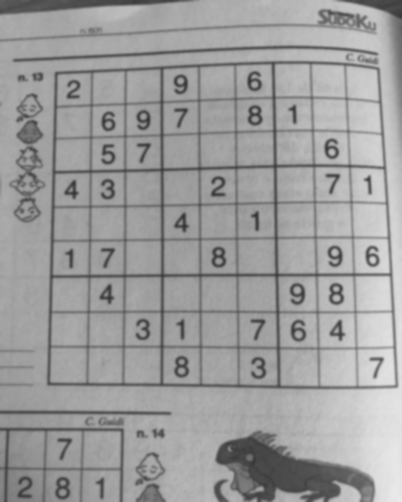

Then, an adaptive gaussian thresholding is applied to obtain a binary image. 
Such algorithm is able to apply a different threshold for different parts of the picture depending on their illumination.

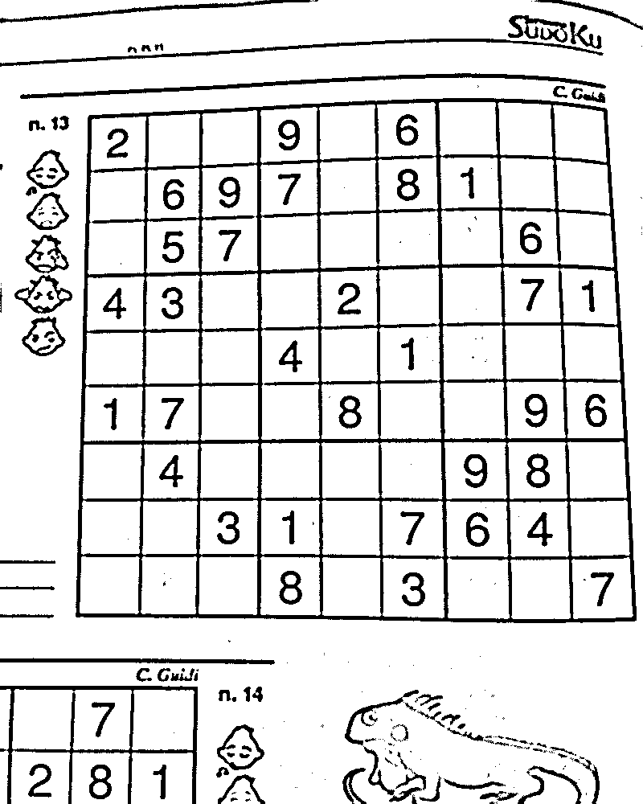

Subsequently, the image is eroded and dilatated to further eliminate noise. It is then inverted to make the contour search feasible.

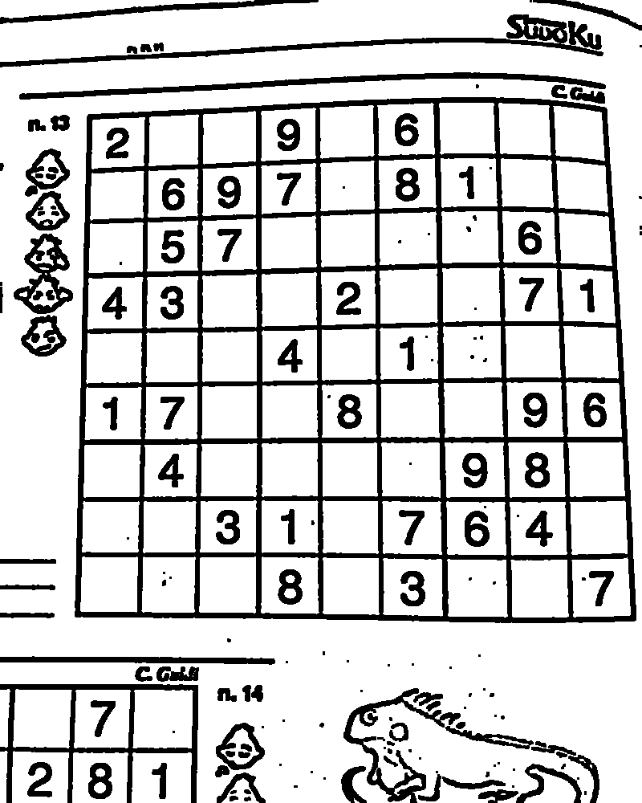
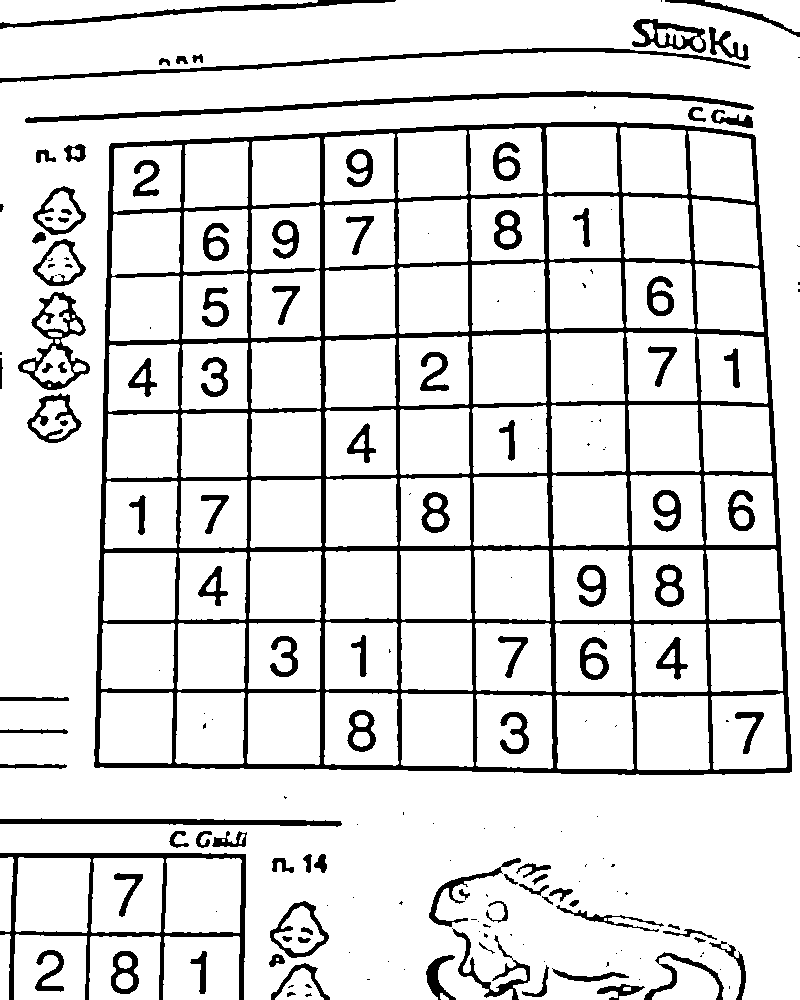
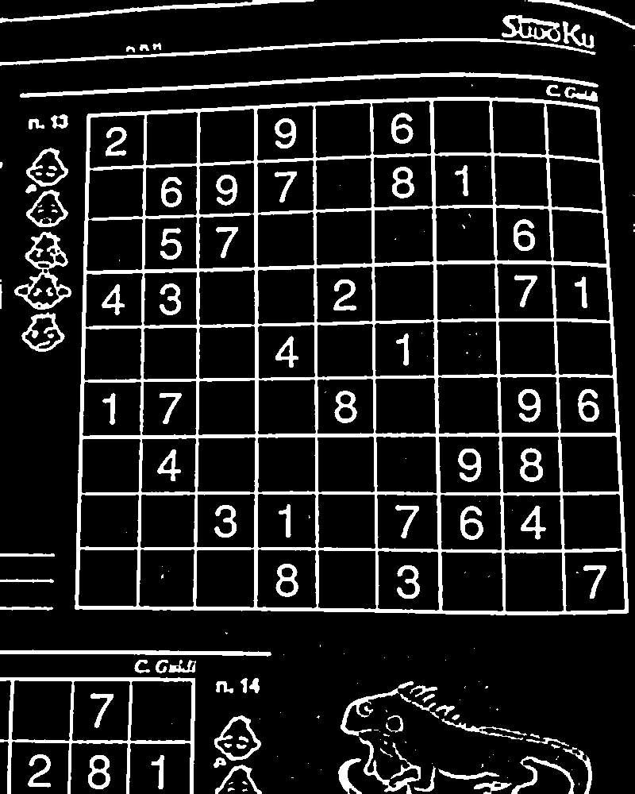

After these image manipulations, the program tries to identify the largest square contour, i.e. the one that contains the sudoku grid.

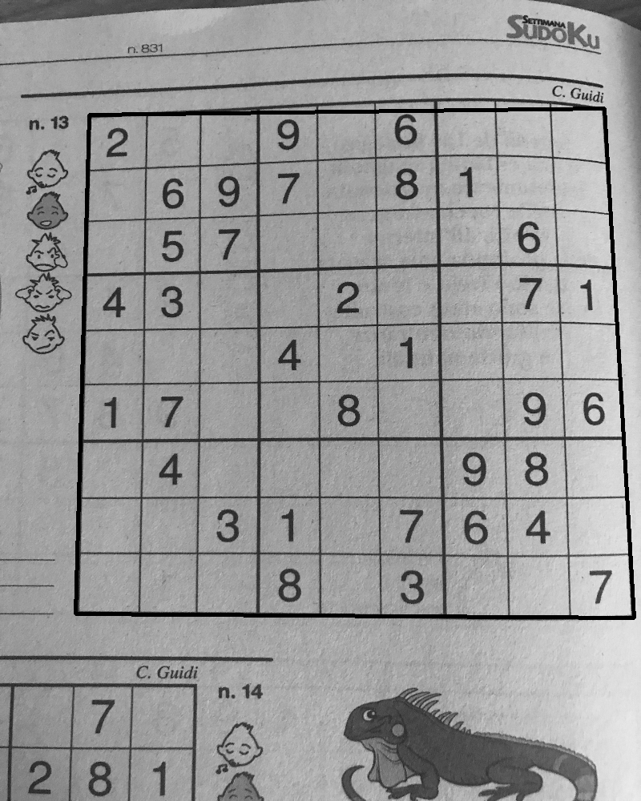

This square is then appropriately cropped and the final image contains just the 9x9 sudoku grid.

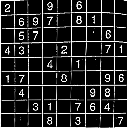

Afterwards, this image is sliced to separate each cell, as the program needs to work on 28x28 images to recognize the digits.

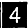

The program tries to recognize, cell by cell, if the square is empty or if it contains a number. 
In the latter case, it will be able to identify which number, but first the digit is isolated and centered in the 28x28 image.

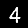


After the cell's images are processed, their digits are recognized using one of the two trained models and the values are put into an array.

### Solve a sudoku

The unsolved sudoku puzzle is represented by a 9x9 array, where a value of 0 denotes an empty cell.\
The algorithm used for the resolution of the sudoku tries to fill the empty positions of the grid with a digit from 1 to 9, 
checking if the operation is valid each time. In fact, a solved sudoku must have all the digits from 1 to 9 in each row, column and 3x3 block.

### Project's GUI

The GUI is composed of three frames in the same position that can be raised one on top of the others. 
This interface links the different programs and allows the user to choose the trained model, 
upload a sudoku image, extract the sudoku puzzle and then solve it. 
Every button has an associated tooltip that can be seen by hoovering over it. 
More about the GUI can be found in the [Usage](#usage) section.
	
## Getting started

### Requirements

Before starting the program, make sure to have `Python 3.9.6` and the following packages installed. 
These specified versions guarantee a correct functioning of the program.

```
numpy 1.20.3

tkinter 8.6

PIL 8.3.1

cv2 4.5.1

sklearn 0.24.2

tensorflow 2.5.0
```

In addition, the following packages are required to run the tests.

```
pytest 6.2.4

hypothesis 6.15.0
```

Use the command `pytest -W ignore::DeprecationWarning` to run the tests and avoid deprecation warnings.

### Installation

Download the repository, unzip the folder and open it on a terminal, then run `python sudoku_GUI.py` to start the program.

## Usage

Read all the descriptions and click on the buttons to proceed within the three pages of the program. 
Hoovering over a button makes a tooltip appear.\
Use the sudoku photos in the `sudoku_test_images` folder or your own images to try the program.

### First page

In the first page, it is possible to choose between two different models. The first model is a CNN trained 
on a dataset composed of the digits from 1 to 9 extracted from a sudoku magazine. This model is then suitable for the recognition of sudoku 
puzzles that have not yet been solved. The second model is a CNN trained on a dataset with handwritten digits too. This dataset is constituted 
by the union of the first dataset and the MNIST handwritten digits dataset. The second model can be used to recognize half-solved sudoku puzzles 
with handwritten digits in addition to printed ones.

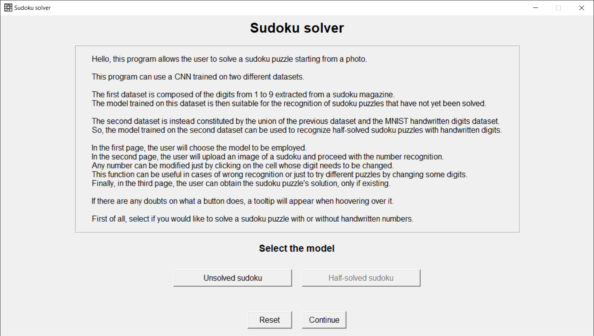

### Second page

In the second page, it is possible to upload an image of a sudoku and recognize the sudoku puzzle's numbers.
Any number can be modified just by clicking on the cell whose digit needs to be changed.
This function can be useful in cases of wrong recognition or just to try different puzzles by changing some digits.

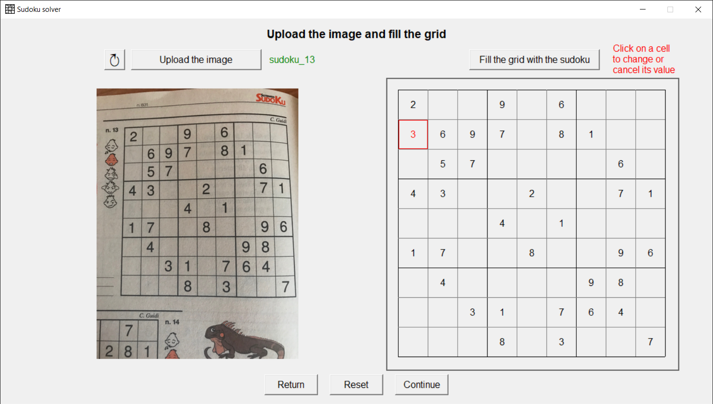

### Third page

In the third page, it is possible to obtain the sudoku puzzle's solution, only if existing.

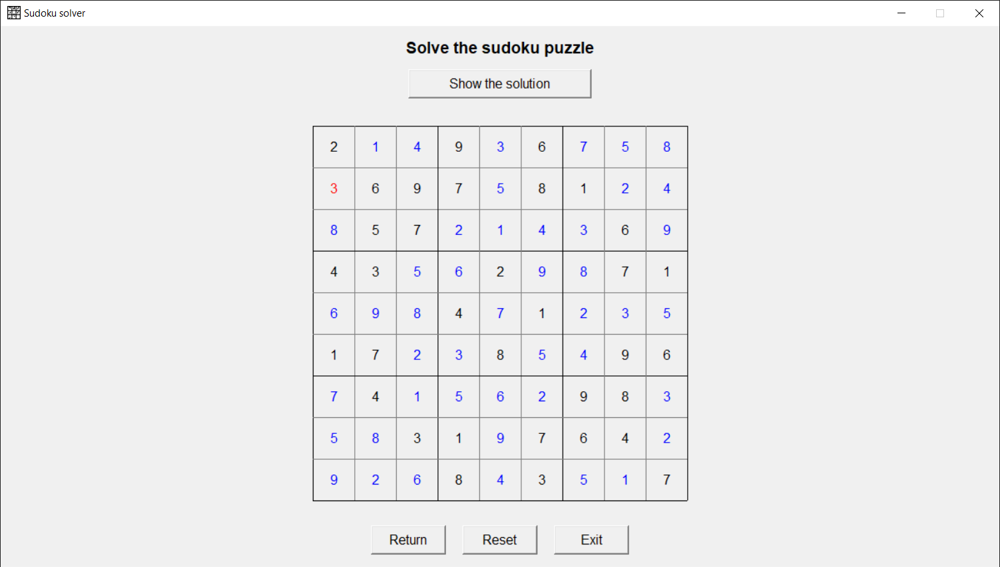

## Acknowledgements

The photos attached for demonstration purpose are of sudoku puzzles taken from the magazine *Settimana Sudoku* number 831.
